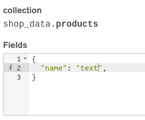

# Full Stack Amazon Clone

This is a simple e-commerce application built with _MERN_ stack. It allows searching for products, adding/removing products from cart. Lastly dummy checkout.

## backend

---

Make sure to have a cluster created in _MongoDB Atlas_, have dummy products dataset loaded in the database. Copy over your db uri to .env file.

In order to use the search functionality do the following process:
Go to: cluster->collection->your_collection->your_database->index.

Add the following index shown in the image below:

In the project directory, run below commands.

_Install all modules:_

### `npm install or yarn`

_Run the server or start the application_

### `nodemon start`

## Frontend

---

Built with React and Typescript. Used Redux for state management.

_Install all modules:_

### `npm install or yarn`

_Run the server or start the application_

### `npm start or yarn start`

## Preview

Coming Soon...

---

This application is by no means perfect. Its created for learning purposes.
